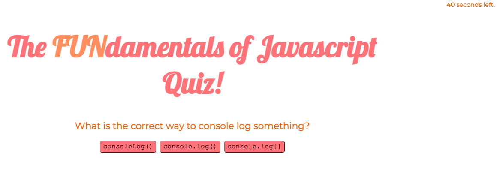
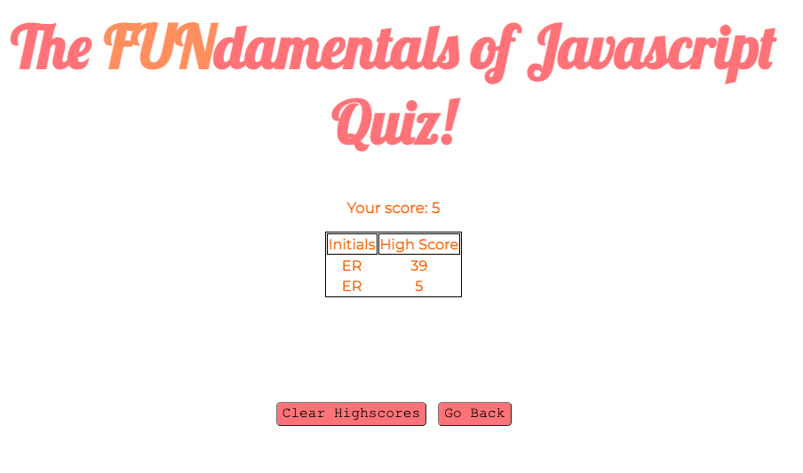

# javascript_fundamentals_quiz

## Description
The quiz will be timed. The user will have 50 seconds to answer all of the questions before time is up. If the timer reaches 0, the quiz will end. The user will receive 10 points for every correct answer. The final score will add the seconds remaining to the user's score. At the end of the quiz, the user will be able to enter their initials in to a form to track scores.

## Usage
The applcation can be used to test a user's knowledge on the fundamentals of javascript. 

The application can be found here: https://emmareimer.github.io/javascript_fundamentals_quiz/

The following images show the web application's appearance and functionality:

